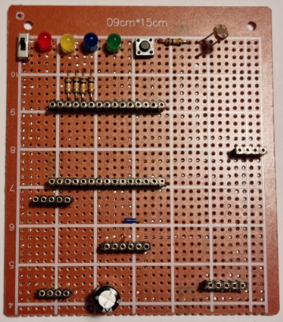
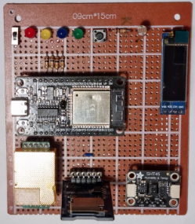
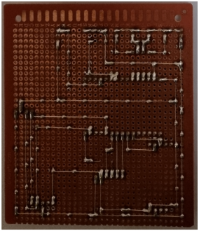
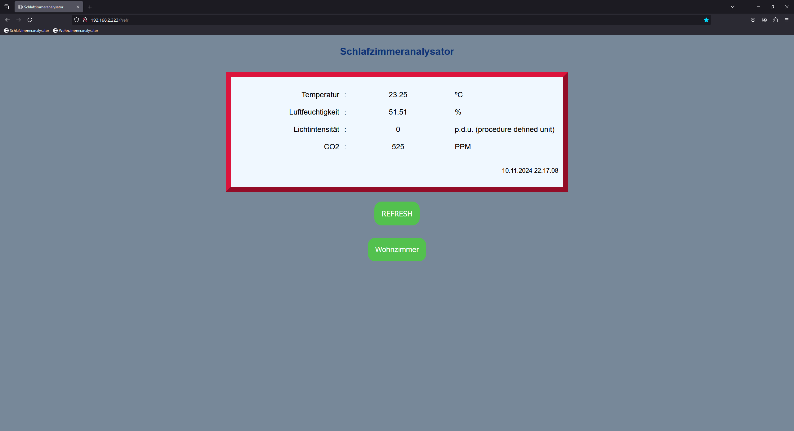

# Zimmeranalysator - Room Analyzer 🌡️💧🌞🌿

**Zimmeranalysator** is a custom-designed circuit board with the ESP32 for real-time environmental monitoring in indoor spaces. It tracks humidity, temperature, light intensity, and CO₂ levels, logging data to a microSD card and hosting a local website to display the latest readings. The device also offers visual feedback to encourage ventilation for optimal indoor air quality.

## Features

- **Environmental Data Logging**: Measures and records humidity, temperature, light, and CO₂ levels onto a microSD card.
- **Wi-Fi Web Server**: Hosts a website on the local network displaying real-time sensor data with refresh capabilities.
- **Multi-Room Navigation**: Easily access data from other Zimmeranalysator devices in nearby rooms.
- **Time Synchronization**: Weekly sync with an NTP server to ensure accurate timestamps.
- **Visual Alerts**: LEDs for quick feedback on air quality:
  - 🟡 Yellow: Maintenance mode
  - 🔵 Blue: High humidity
  - 🔴 Red: High CO₂ levels
  - 🟢 Green: Optimal air quality

## Circuit Board Design

- **Front View**:  
  
  
- **Front View with Modules**:  
  

- **Back View**:  
  

- **Circuit Design (PDF)**:
  [Circuit Design PDF](ZimmeranalysatorV2/Design/CompleteDesign.pdf)

## Getting Started

### Prerequisites

- **Hardware**: TBD
- **Software**: TBD

### Installation

1. **Hardware Setup**: Assemble the Zimmeranalysator circuit board and insert a microSD card.
2. **Wi-Fi Configuration**: 
   - Create a txt-file on the microSD card with Wi-Fi credentials to connect to the local network.
   - The first row has to be the ssid (network name) and the second row the password.
3. **Libraries**: Download the following Arduino libraries: TBD
4. **Microcontroller Software**: Upload the Arduino Code to the ESP32.

### Usage

- TBD

## Data Analysis

A Python script is included to plot the logged data from the microSD card for deeper analysis.

### Plotting Data with Python

- TBD

## Future Enhancements

- Converting the Arduino Code to Micropython for easily changing the website
- 3D printed Case
- Algorithm to calculate the exact light intensity in lumen and lux
